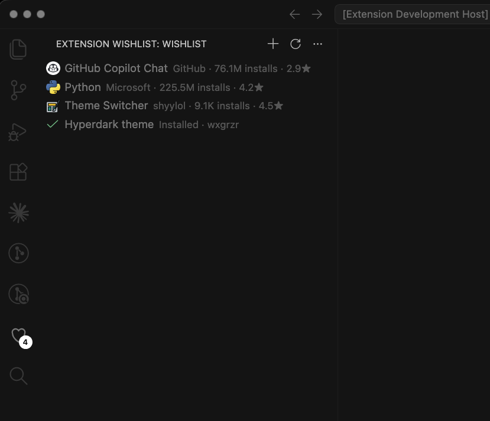
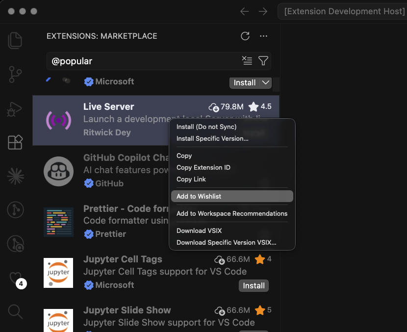
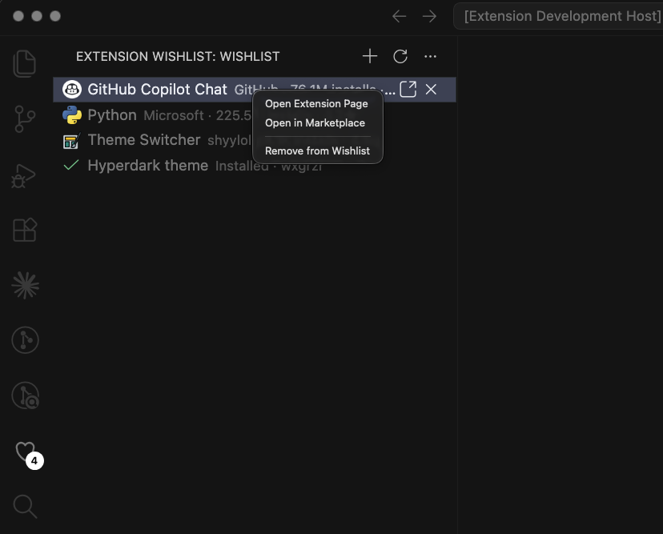

# Extension Wishlist

Bookmark VS Code Marketplace extensions to a wishlist and try them later — without being forced to install and download them now.

Found an interesting extension but don't want to install it right this moment? Save it to your wishlist and come back to it when you're ready.

## Why use a wishlist?

Installing every extension you come across bloats your setup and slows down VS Code's startup. Extension Wishlist lets you bookmark VS Code extensions the moment you spot them — in the Marketplace, in a blog post, in a colleague's recommendation — and decide later whether they're worth installing. Think of it as a reading list for your Extensions view.

## Features

- **Add from the native Extensions view** — right-click any extension and choose **Add to Wishlist**. No custom search UI; it stays out of the way of VS Code's built-in Marketplace.

  

- **Wishlist instead of install** — saved extensions aren't downloaded until you decide to try them.
- **Sidebar list** in the Activity Bar showing everything you've saved, with a count badge. Click an item to open its page **inside VS Code**, where you can install it with the native UI.
- **Installed at a glance** — once a wishlisted extension is installed, its row shows a ✓ "Installed" marker and an inline **Uninstall** action.

  

- **Add by ID** for extensions you already know (e.g. `esbenp.prettier-vscode`).
- **Settings Sync** — your wishlist roams across your machines automatically.

## Getting started

1. Install the extension and open the **Extension Wishlist** view from the Activity Bar (the bookmark icon).
2. Browse the built-in **Extensions** view, right-click any extension, and choose **Add to Wishlist**.
3. Your saved extensions appear in the sidebar. Click one to open its page in VS Code and install it whenever you're ready.

Prefer to add something you already know by name? Click **Add by Extension ID** in the wishlist view and enter its id (e.g. `esbenp.prettier-vscode`).

## Commands

| Command | Description |
| --- | --- |
| `Extension Wishlist: Add to Wishlist` | Right-click an extension in the Extensions view to save it |
| `Extension Wishlist: Add by Extension ID` | Wishlist an extension by its id |
| `Extension Wishlist: Open Extension Page` | Open a wishlisted extension's page in VS Code |
| `Extension Wishlist: Uninstall Extension` | Uninstall an installed wishlisted extension |
| `Extension Wishlist: Remove from Wishlist` | Remove a saved extension |
| `Extension Wishlist: Clear Wishlist` | Remove everything |

## Feedback & issues

Found a bug or have a feature request? Please [open an issue](https://github.com/wxgrzr/vscode-extension-wishlist/issues).

## License

[MIT](LICENSE) © William Greer
